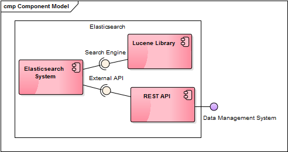
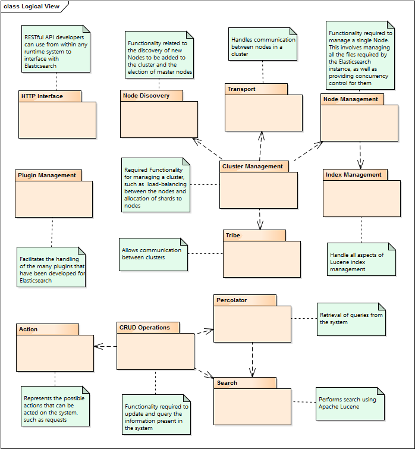
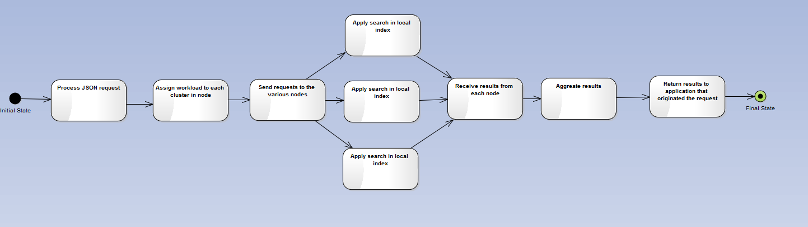
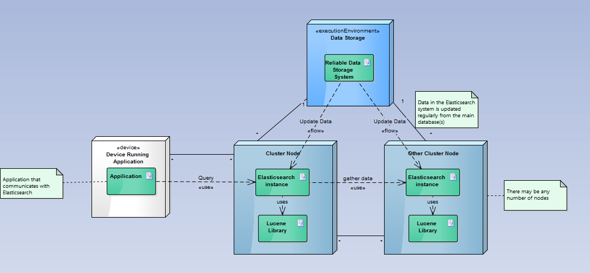

ESOF - Third Report
====================
Elasticsearch is a distributed search engine and data storage system based on Apache Lucene.

<a name="index"/>
## Menu
1. [Introduction](#intro)
2. [Lucene Library](#lucene)
3. [REST API](#rest)
4. [Implementation View](#implementation)
5. [Logical View](#logical)
6. [Process View](#process)
7. [Deployment View](#deployment)
8. [Architectural Patterns](#patterns)

<a name="intro" />
Introduction
------------
The purpose of this report is to better explain some of the attributes of Elasticsearch. Using the 4+1 Architectural View Model, whose diagrams can be seen below, it is much easier to comprehend Elasticsearch's arquitectural aspects.

Firstly, some of the terms used in the diagrams will be explained for a better understanding of the matter.

Then, the diagrams of the 4+1 Architectural View Model as well as its explanations will be presented. Starting with the Component Diagram, referent to the Implementation View, followed by the Package Diagram, referent to the Logical View, Activity Diagram is next, referent to the Process View and finally the Deployment Diagram, referent to the Deployment View. These four views represent the 4 in the architectural view model mentioned before. As for the +1, it stand for the Use Cases Model which was presented in the last report.

<a name="lucene" />
Lucene Library
--------------
Apache LuceneTM is a high-performance, full-featured text search engine library written entirely in Java. It is a technology suitable for nearly any application that requires full-text search, especially cross-platform.
Elasticsearch uses Lucene as a search server.

<a name="rest" />
REST API
--------
REST (REpresentational State Transfer) is an architectural style, and an approach to communications that is often used in the development of Web services.
REST'S decoupled architecture, and lighter weight communications between producer and consumer, make REST a popular building style for cloud-based APIs. When Web services use REST architecture, they are called RESTful APIs (Application Programming Interfaces) or REST APIs. Elasticsearch is a RESTful API.

<a name="implementation" />
Implementation View
-------------------
A Component Diagram shows how components are wired together in the software. Components are wired together by using an assembly connector to connect the required interface of one component with the provided interface of another component. This illustrates the service consumer - service provider relationship between the two components.

The Component Diagram below represents the Implementation View of Elasticsearch: 

  
    
      
Component Diagram

    

<a name="logical"/>
Logical View
------------

  
    
      
Package Diagram

    

<a name="process"/>
Process View
------------

  
    
      
Activity Diagram

    

<a name="deployment"/>
Deployment view
---------------

  
  
      
Deployment Diagram

  

<a name="patterns"/>
Architectural Patterns
----------------------

* Data flow
* Client Server
