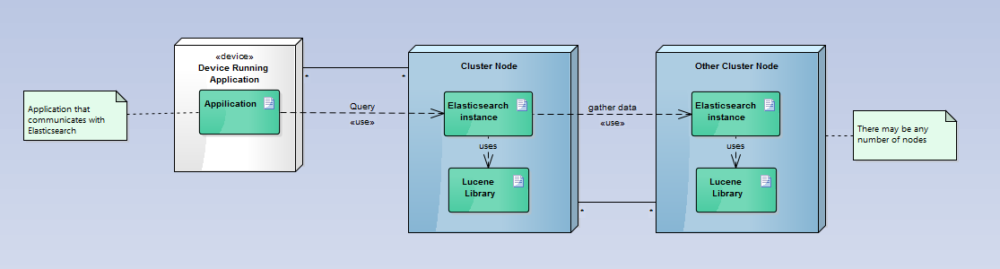

ESOF - Third Report
====================
Elasticsearch is a distributed search engine and data storage system based on Apache Lucene.

<a name="index"/>
## Menu
1. [Overview](#overview)
1. [Implementation View](#implementation)
2. [Logical View](#logical)
3. [Process View](#process)
4. [Deployment View](#deployment)

<a name="overview" />
Overview
-------

<a name="implementation" />
Implementation View
-------------------

  

<a name="logical"/>
Logical View
------------

<a name="requirements"/>
Process View
------------

<a name="deployment"/>
Deployment view
---------------

  

